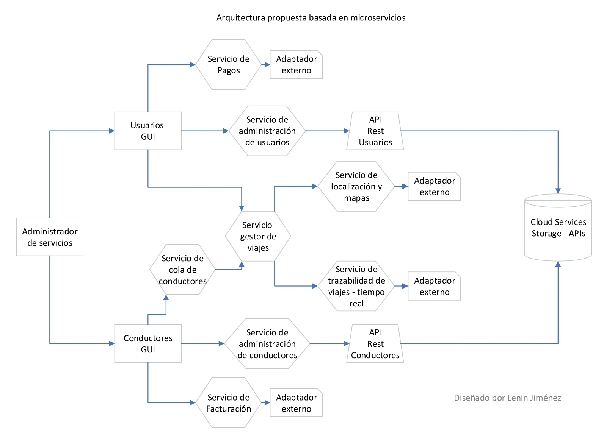

# UberAppSolution
This project is an analysis of the structure of the uber app.

## Características
- Perfil de usuarios y perfil de conductores 
- Los usuarios pueden solicitar el servicio de transporte
- Los usuarios conductores estarán emitiendo constantemente las coordenadas de sus
posición actual
- Los servicios solicitados por usuarios solo le llegaran a los usuarios conductores que estén
dentro de un rango en kms.
- Cuando un usuario conductor acepte un servicio, en la aplicación de usuario debe mostrar un
seguimiento en tiempo real del usuario conductor, para saber por dónde se dirige
- Cuando un usuario conductor acepte un servicio este no podrá recibir más servicios.
- Cuando el usuario cancele el servicio este debe notificarle al usuario conductor la
cancelación del servicio y dejarlo disponible para recibir nuevos servicios
- Cuando el usuario conductor finalice un servicio se le debe notificar el término del servicio a
la app de usuario

## Esquema lógico
En la estructuración de la infraestructura de software, si bien para una app con iguales características puede emplearse un esquema monolítico, se tienen problemas en el crecimiento de la misma. Por lo tanto, lo más idóneo es establecer una arquitectura orientada a servicios (SOA).

Una arquitectura de microservicios pone cada funcionalidad (lo más minimalista posible) en un servicio separado, y la forma que tiene de crecer es distribuyendo estos servicios a través de los servidores, replicando de acuerdo a las necesidades del negocio.

Cabe notar que las principales desventajas de esta arquitectura es la complejidad en el desarrollo, la operación y el mantenimiento.

### Almacenamiento
La opción correcta para un servicio con capacidad de escalabilidad y para el ahorro de presupuesto, son los servicios bajo demanda Cloud. Existen varias obciones, AWS, Google Cloud, Azure, DigitalOcean, Oracle Cloud Infrastructure, etc. En este caso, debido a la capacidad de perzonalización de los servicios, el mejor costo y a la estabilidad de la plataforma, se opta por AWS (Amazon Web Services).

Amazon S3 ofrece una variedad de clases de almacenamiento entre las cuales puede elegir en función de los requisitos de acceso a los datos, resiliencia y costos de sus cargas de trabajo. Las clases de almacenamiento de S3 se crearon específicamente para brindar el menor costo posible de almacenamiento para los diferentes patrones de acceso.

Las clases de almacenamiento de S3 incluyen S3 Intelligent-Tiering para el ahorro automático de costos destinado a los datos con patrones de acceso desconocidos o cambiantes; S3 Standard para los datos a los que accede con frecuencia; S3 Standard-Infrequent Access (S3 Standard-IA) y S3 One Zone-Infrequent Access (S3 One Zone-IA) para los datos a los que accede con menor frecuencia; S3 Glacier Instant Retrieval para los datos de archivo que requieren acceso inmediato; S3 Glacier Flexible Retrieval (antes S3 Glacier) para los datos de largo plazo a los que se accede de forma inusual y que no requieren acceso inmediato; y Amazon S3 Glacier Deep Archive (S3 Glacier Deep Archive) para el archivo a largo plazo y la preservación digital con recuperación en horas al costo más bajo de almacenamiento en la nube. 

Para seleccionar la mejor opción se considera lo siguiente:
1. Los servicios tienen una alta frecuencia de consulta
2. La disponibilidad de los datos debe ser amplia y comn una baja latencia
3. Los costos deben ser optimizados de acuerdo a la demanda, por lo cual se debe optar por una opción con predict o basada en auto-optimization
4.  Adaptabilidad a modificaciones en la infraestructura y/o servicios

Adicionalmente, se propone la siguiente imagen sobre los servicios de almacenamiento de AWS

La opción más idónea es  Amazon S3 Intelligent-Tiering (S3 Intelligent-Tiering)

##### Amazon S3 Intelligent-Tiering (S3 Intelligent-Tiering) 
Es el primer almacenamiento en la nube que reduce automáticamente los costos de almacenamiento a nivel pormenorizado de objeto al mover de manera automática los datos al nivel de acceso más rentable según la frecuencia de acceso, sin afectar el rendimiento, las tarifas de recuperación ni los gastos operativos generales. S3 Intelligent-Tiering ofrece una latencia en milisegundos y un alto rendimiento para los datos a los que se accede de manera frecuente, poco frecuente y de forma inusual en los nuevos niveles de acceso instantáneo, frecuente y poco frecuente a archivos. Puede utilizar S3 Intelligent-Tiering como la clase de almacenamiento predeterminada para prácticamente cualquier carga de trabajo, en especial lagos de datos, análisis de datos, aplicaciones nuevas y contenido generado por el usuario.

Por un pequeño cargo mensual de monitoreo y automatización de objetos, S3 Intelligent-Tiering monitorea los patrones de acceso y traslada de forma automática los objetos a los que no se accedió a los niveles de acceso de menor costo. S3 Intelligent-Tiering almacena objetos automáticamente en tres niveles de acceso: un nivel optimizado para el acceso frecuente, un nivel con un costo 40 % menor optimizado para el acceso poco frecuente y otro nivel con un costo 68 % menor optimizado para los datos a los que se accede en pocas ocasiones. S3 Intelligent-Tiering monitorea los patrones de acceso y traslada los objetos a los que no se accedió durante 30 días consecutivos al nivel de acceso Poco frecuente y, después de 90 días sin acceso, al nuevo nivel de acceso Instantáneo al archivo. Para los datos que no requieren recuperación inmediata, puede configurar S3 Intelligent-Tiering de manera que monitoree y traslade de forma automática los objetos a los que no se ha accedido durante 180 días o más al nivel de acceso a archivo profundo para conseguir un ahorro en los costos de almacenamiento de hasta el 95 %.

No hay cargos de recuperación en S3 Intelligent-Tiering. Si después se accede a un objeto en el nivel de acceso Poco frecuente o Instantáneo al archivo, se devuelve automáticamente al nivel de acceso Frecuente. Si el objeto que está recuperando se encuentra almacenado en los niveles opcionales de Archivo profundo, antes de poder recuperar el objeto, debe restaurar primero una copia mediante RestoreObject.  Para obtener más información sobre la restauración de objetos archivados, consulte Restauración de objetos archivados. No se aplican cargos adicionales a los niveles cuando los objetos se desplazan entre los niveles de acceso dentro de la clase de almacenamiento S3 Intelligent-Tiering.

Características principales:

- Los niveles de acceso Frecuente, Poco frecuente e Instantáneo al archivo tienen la misma baja latencia y alto rendimiento de S3 Standard
- El nivel de acceso Poco frecuente ahorra hasta un 40 % en costos de almacenamiento
- El nivel de acceso instantáneo al archivo ahorra hasta un 68 % en costos de almacenamiento
- Incluye capacidades opcionales de archivo asíncrono para objetos a los que se accede de forma inusual
- El nivel de acceso Archivo profundo tiene el mismo rendimiento que Glacier Deep Archive y ahorra hasta un 95 % para los objetos a los que se accede de forma inusual
- Está diseñada para ofrecer un nivel de durabilidad del 99,999999999 % de los objetos en varias zonas de disponibilidad y para una disponibilidad del 99,9 % durante un año determinado
- Está respaldada por el Acuerdo de nivel de servicios de Amazon S3 en relación con la disponibilidad
- Presenta un pequeño cargo mensual por monitoreo y ubicación automática en el nivel adecuado
- No tiene gastos operativos generales, cargos de ciclo de vida, cargos de recuperación ni duración mínima del almacenamiento
- Estos objetos de tamaño inferior a 128KB se pueden almacenar en S3 Intelligent-Tiering, pero siempre se cobran de acuerdo con las tarifas de nivel de acceso Frecuente, sin cargos de monitoreo y automatización.

