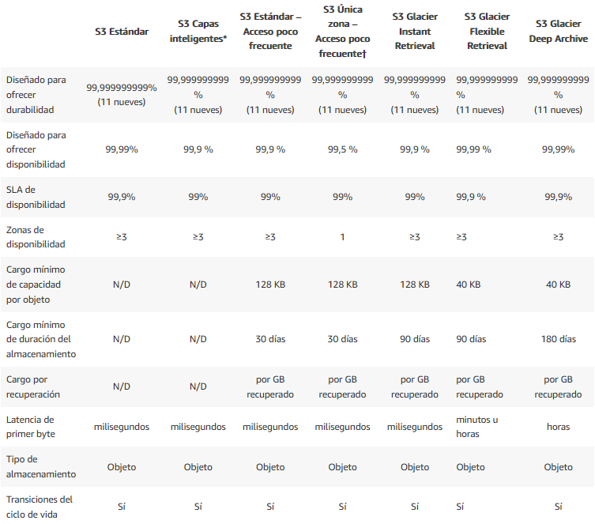

# UberAppSolution
This project is an analysis of the structure of the uber app.

## Características
- Perfil de usuarios y perfil de conductores 
- Los usuarios pueden solicitar el servicio de transporte
- Los usuarios conductores estarán emitiendo constantemente las coordenadas de sus
posición actual
- Los servicios solicitados por usuarios solo le llegaran a los usuarios conductores que estén
dentro de un rango en kms.
- Cuando un usuario conductor acepte un servicio, en la aplicación de usuario debe mostrar un
seguimiento en tiempo real del usuario conductor, para saber por dónde se dirige
- Cuando un usuario conductor acepte un servicio este no podrá recibir más servicios.
- Cuando el usuario cancele el servicio este debe notificarle al usuario conductor la
cancelación del servicio y dejarlo disponible para recibir nuevos servicios
- Cuando el usuario conductor finalice un servicio se le debe notificar el término del servicio a
la app de usuario

## Esquema lógico
En la estructuración de la infraestructura de software, se parte de un esquema monolítico base para formar una arquitectura orientada a servicios (SOA). Por lo tanto, se establece una arquitectura basada en microservicios.
Una arquitectura de microservicios pone cada funcionalidad (lo más minimalista posible) en un servicio separado, y la forma que tiene de crecer es distribuyendo estos servicios a través de los servidores, replicando de acuerdo a las necesidades del negocio.

### Almacenamiento
La opción correcta para un servicio con capacidad de escalabilidad y para el ahorro de presupuesto, son los servicios bajo demanda Cloud. Existen varias obciones, AWS, Google Cloud, Azure, DigitalOcean, Oracle Cloud Infrastructure, etc. En este caso, debido a la capacidad de perzonalización de los servicios, el mejor costo y a la estabilidad de la plataforma, se opta por AWS (Amazon Web Services).

Amazon S3 ofrece una variedad de clases de almacenamiento entre las cuales puede elegir en función de los requisitos de acceso a los datos, resiliencia y costos de sus cargas de trabajo. Las clases de almacenamiento de S3 se crearon específicamente para brindar el menor costo posible de almacenamiento para los diferentes patrones de acceso.

Las clases de almacenamiento de S3 incluyen S3 Intelligent-Tiering para el ahorro automático de costos destinado a los datos con patrones de acceso desconocidos o cambiantes; S3 Standard para los datos a los que accede con frecuencia; S3 Standard-Infrequent Access (S3 Standard-IA) y S3 One Zone-Infrequent Access (S3 One Zone-IA) para los datos a los que accede con menor frecuencia; S3 Glacier Instant Retrieval para los datos de archivo que requieren acceso inmediato; S3 Glacier Flexible Retrieval (antes S3 Glacier) para los datos de largo plazo a los que se accede de forma inusual y que no requieren acceso inmediato; y Amazon S3 Glacier Deep Archive (S3 Glacier Deep Archive) para el archivo a largo plazo y la preservación digital con recuperación en horas al costo más bajo de almacenamiento en la nube. 

Para seleccionar la mejor opción se considera lo siguiente:
1. Los servicios tienen una alta frecuencia de consulta
2. La disponibilidad de los datos debe ser amplia y comn una baja latencia
3. Los costos deben ser optimizados de acuerdo a la demanda, por lo cual se debe optar por una opción con predict o basada en auto-optimization

Adicionalmente, se propone la siguiente imagen sobre los servicios de almacenamiento de AWS

